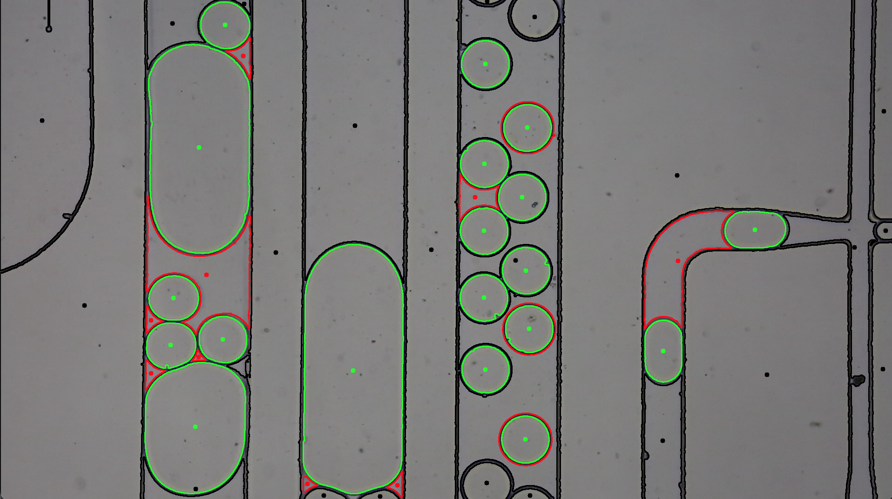
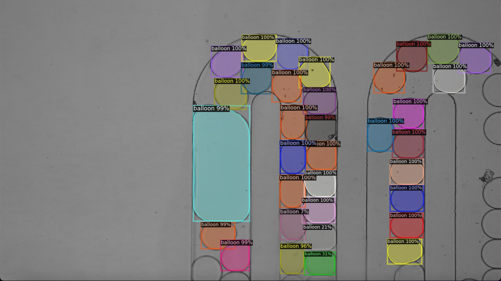

 Droplet Detection Algorithm
---------------------

This project consists of two separate codes. The first one is an algorithm I developed based on conventional image analysis. The second one uses the Detectron2 deep learning algorithm from Meta group.

### Using my algorithm

Here are the main steps for installation and usage.

1. Create a PyCharm environment and verify that the virtual environment folder (`venv`) has been created.
2. Clone the project from GitLab using either SSH or HTTPS. For example:
```bash
cd /path/to/your/python/project/and/venv/directory/
git clone git@gitlab.uliege.be:K.Maltez/tracking_droplets.git
```
3. Open the project in PyCharm. The relevant files for this model are `training_svc_blackhat.py`, `tracking_droplet_blackhat.py`, and the `svc` directory.
4. Install necessary libraries by running the following command in the PyCharm terminal (make sure to install them in the virtual environment):
```
pip install matplotlib numpy opencv-python time pandas scikit-image scipy scikit-learn joblib trackpy mplcursors
```

To use the code, follow these steps:

1. Navigate to the `files` dictionary in `tracking_droplet_blackhat.py`. Change the path to your video file of choice. You can save multiple paths as "video1", "video2", etc., to avoid retyping it each time you change videos.
2. In the `main` section, specify your video with `video = "video7"` (for example). This corresponds to the previously defined path.
3. Still at the beginning of `main`, adjust the main parameters such as pixel size and frames per second (fps) according to your video. Also choose which images to load through the `video_sampling`, `start_frame`, and `end_frame` variables. Note that changing the sampling rate will also affect the fps.
4. Run the code! The detected drops should appear in green.

For more information about how the code works and how to adapt it to your needs, see `algorithm1.md`. For the use of detectron2, see `algorithm2.md`.

As this is a first version, feel free to provide feedback regarding optimization or potential bugs. I will do my best to correct them over time.

Here is an example of droplets detections based on the first algorithm



And here another example is provided by using detectron2 (note that I forgot to change 'balloon' to 'droplet' following a tutorial on using detectron2 <https://gilberttanner.com/blog/detectron-2-object-detection-with-pytorch/>) 



